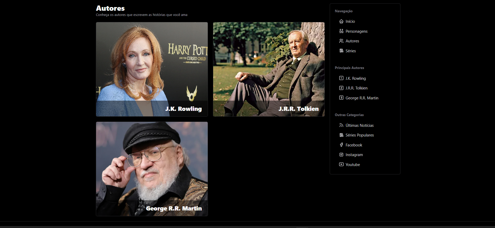

# ordem-livros

Ordem Livros é uma aplicação que exibe autores, livros e outros dados literários. Desenvolvida utilizando HTML, CSS, Svelte e JavaScript, permite a exploração de listas de livros, biografias dos autores e resenhas.




## O que é este projeto?

Ordem Livros é uma aplicação web que possibilita aos usuários explorar uma coleção de livros e informações relacionadas aos autores. Com uma interface interativa construída com Svelte, HTML e CSS, o projeto oferece uma experiência intuitiva para descobrir novas leituras e detalhes sobre cada título e seu autor.

## Como rodar o projeto?

### Requisitos

- Navegador moderno
- (Opcional) Servidor local para desenvolvimento

### Passos para executar

1. Clone o repositório:

   ```sh
   git clone https://github.com/seu-repositorio/ordem-livros.git
   ```

2. Acesse o diretório do projeto:

   ```sh
   cd ordem-livros
   ```

3. Abra o arquivo `index.html` em seu navegador ou utilize um servidor local (como o Live Server do VS Code).

## Tecnologias Utilizadas

 <div style="display: grid; grid-template-columns: repeat(auto-fit, minmax(80px, 1fr)); gap: 10px; align-items: center;">
   
   
   
   
 </div>
    
  ## Features do Projeto
  - Exibição organizada de livros e autores
  - Interface responsiva e intuitiva
  - Navegação interativa e dinâmica
    
  ## Links Úteis
  - [Documentação do HTML](https://developer.mozilla.org/pt-BR/docs/Web/HTML)
  - [Documentação do CSS](https://developer.mozilla.org/pt-BR/docs/Web/CSS)
  - [Documentação do Svelte](https://svelte.dev/docs)
  - [Documentação do JavaScript](https://developer.mozilla.org/pt-BR/docs/Web/JavaScript)
